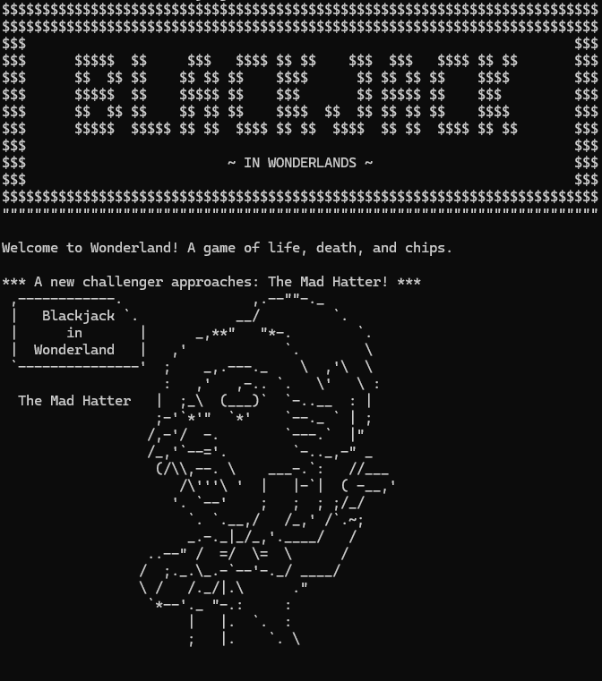
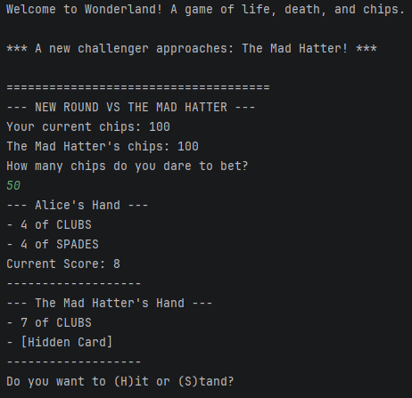
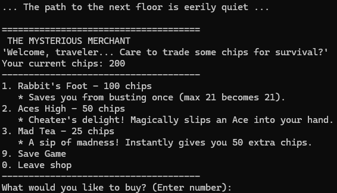

# 🎩 Blackjack in Wonderland: A Console-Based Java RPG

Blackjack in Wonderland is a text-based Role Playing Game built entirely in pure Java, running directly in the console.

Rather than relying on external game engines, this project was developed from scratch with a strong focus on **Object-Oriented Programming (OOP)**, **clean architecture**, and **scalable software design patterns**. It serves as a technical showcase of core backend development principles.

---

## 🏗️ Architecture & Design Patterns

This project was built to be easily maintainable and highly scalable. Key architectural decisions include:

* **Data-Driven Design (Events System):** Random encounters are not hardcoded. The `EventManager` dynamically parses an external `events.txt` file at runtime. This completely decouples the event logic from the Java codebase, allowing designers to add hundreds of new events without altering a single line of code, strictly adhering to the **Open/Closed Principle (SOLID)**.
* **Factory & Registry Patterns (Dynamic Shop):** In-game items are managed through an `ItemRegistry`. The `Shop` class generates its inventory dynamically by requesting random registered IDs from the Factory, ensuring the Shop logic remains completely agnostic of the actual item implementations.
* **Single Responsibility Principle (UI & Visuals):** * **`DisplayManager`**: Handles the "Game Feel", creating a custom typewriter effect and managing execution pauses.
    * **`ArtManager`**: Uses `HashMap` data structures to store and retrieve ASCII art with O(1) time complexity, keeping the core game engine free of visual clutter.

---

## 📸 Screenshots

  <figure style="display: inline-block; text-align: center; margin: 20px;">
    
    <figcaption style="margin-top: 10px; font-style: italic; color: #555;">Entering Floor 1: The Mad Hatter encounter.</figcaption>
  </figure>

    <figure style="display: inline-block; text-align: center; margin: 20px;">
    
    <figcaption style="margin-top: 10px; font-style: italic; color: #555;">Battle gameplay.</figcaption>
  </figure>

    <figure style="display: inline-block; text-align: center; margin: 20px;">
    
    <figcaption style="margin-top: 10px; font-style: italic; color: #555;">The Dynamic Shop system generating random items.</figcaption>
  </figure>

---

## 🚀 How to Play

No IDE is required to play. The game is packaged as an executable `.jar` file.

1. Download the latest release folder containing:
    * `HeartsQueen.jar` (The game engine)
    * `events.txt` (The data-driven event database)
    * `run.bat` (The Windows launcher)
2. Ensure all three files are in the same directory.
3. Double-click **`run.bat`** to start your journey into Wonderland.

---

## 🗺️ Roadmap & Next Steps

This project is continuously evolving. Upcoming milestones focus on expanding the game's universe and ensuring stability:

- [ ] **Rich Narrative Integration:** Expand the game's lore with a deeper contextual storyline, intro sequences, and character dialogue to fully immerse the player in Wonderland.
- [ ] **Content Expansion:** Significantly scale the game's universe by adding new unique enemies, challenging bosses, and a wider variety of custom items to the `ItemRegistry`.
- [ ] **Advanced Data-Driven Events:** Leverage the newly created `events.txt` system to introduce dozens of new dynamic encounters, hidden traps, and branching scenarios.
- [ ] **Unit Testing & Reliability:** Implement `JUnit` tests to verify the core engine, `ItemRegistry`, and Shop logic to prevent bugs as the content grows.

---
*Developed by Miguel.*